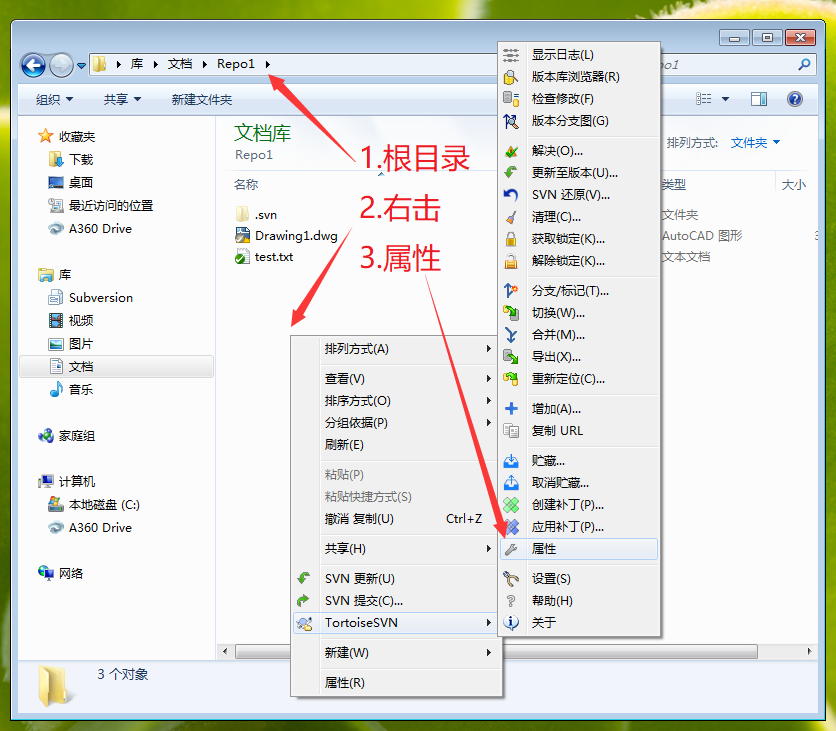
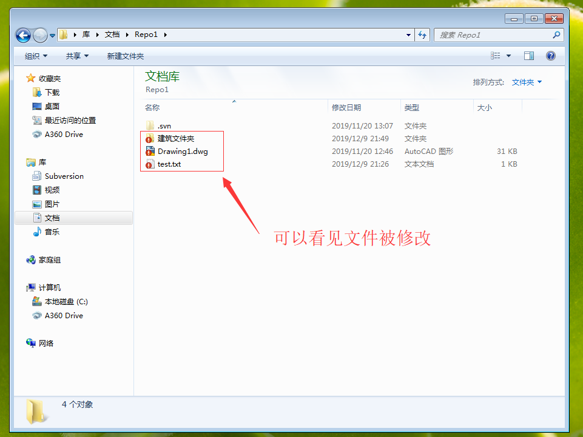

[SVN官网](https://tortoisesvn.net/)

# 概念

- repository
- sandbox 
<!-- TODO sandbox 是什么 -->
- SVN目录
  - Trunk
  - Tag
  - Branch
- SVN操作
  - checkout
  - export
  - update
  - commit
  - delete
  - show log
  - add
  - revert


两种模型
- 拷贝-修改-合并 (update-modify-commit)
- 锁定-编辑-解锁 (lock-modify-unlock)

自动锁定
[SVN文件加锁](https://www.cnblogs.com/slysky/p/8921154.html)


# 协同的几种方式

## 共享磁盘（Windows共享）

## 版本控制（局域网）

## 版本控制（互联网）


# SVN的安装和基本模型

## 安装

## 汉化

## 图标


# 检出仓库

## 仓库地址

### 本地地址

### 服务端地址


# 工作模式

## 两种模式

- **拷贝-修改-合并**工作模式
- **锁定-编辑-解锁**工作模式

## 更高级的使用方法

- 分支
- 合并

# **锁定-编辑-解锁**工作模式

## 应用场景问题描述
- 检出一个工作目录
- 确保所有不是自己的工作文件都是只读
- 获取自己的工作文件修改权
- 修改后**释放**所有权
- 修改后**保留**所有权
- 新建文件并修改，提交，**保留**所有权

### 问题一：任何人(A1,A2,S1,S2)将文件从仓库检出后，文件要是只读状态
#### 解决方式一：在专业负责人分配任务时新建文件，并划分文件权限，操作方式
#### 解决方式二（弥补方式）：对旧有文件的强制只读属性设置（svn:needs-lock）
***
具体操作：

1. 打开根目录Repo1

<!--  -->

2. 在根目录右击属性（文件夹空白处右键属性）


1. 在属性中选择，新建，需要锁定


1. 需要锁定目录下，选择请求锁定（只读跟新），默认勾选递归应用，选择确定


1. 可以看见文件虽然没有打开修改过，但都是被修改的符号标识


1. 此时右击提交修改


1. 可以看到文件本身未被修改，但是属性被修改了


1. 将这些修改的属性提交给服务器


1. 恢复了正常同步状态


1. 此时再在目录中新建文件

### 问题二：获取自己文件的所有权

1. 选择自己的文件，右击，选择获取锁定

2. 在获取锁定对话框，填写获取锁定的原因，勾选文件，点击确定

3. 显示获取锁定成功，点击确定

4. 文件已被解锁

5. 用同样的方式解锁两个文件


### 问题三：提交之后**交出**文件所有权


### 问题四：提交之后**保留**文件所有权


### 问题五：找不到服务器
提交时出现以下错误


## 问题场景
项目有如下文件结构：
```txt
Repo(根目录)
    参照文件夹：
        A-ref-001.dwg
        S-ref-001.dwg
    建筑文件夹：
        A-001.dwg
        A-002.dwg
        A-003.dwg
    结构文件夹：
        S-001.dwg
        S-002.dwg
        S-003.dwg
```
- 建筑设计师(A1)，负责图纸：A-001.dwg，A-ref-001.dwg；
- 建筑设计师(A2)，负责图纸：A-002.dwg，A-003.dwg，A-004.dwg(未创建)。
- 结构设计师(S1)，负责图纸：S-001.dwg，S-ref-001.dwg；
- 结构设计师(S2)，负责图纸：S-002.dwg，S-003.dwg，S-004.dwg(未创建)。


## 自动锁定问题


#### 新建文件时自动给文件设置强制只读属性 svn:needs-lock

具体操作：
从SVN客户端的“设置”界面打开配置文件，在结尾增加：

```
[miscellany]
enable-auto-props = yes
[auto-props]
= svn:needs-lock
```


在提交后文件锁不释放
    后面添加代码
    [miscellany]
    no-unlock = yes

# CW
[miscellany]
enable-auto-props = yes
no-unlock = yes
global-ignores = *.bak *.dwl *.dwl2
[auto-props]
= svn:needs-lock


## 2019-11-17 有一个人可以分配某一个目录下的权限
解决方式：在每次项目开始前进行权限分配，将权限分配到文件夹。
[文件](D:\Repositories\ZZJC\conf\VisualSVN-SvnAuthz.ini)
记录了svn 的权限设置
做一个模板文件:**项目启动权限设置.ini**

注意：任何配置文件的有效配置行，都**不允许存在前置空格**。

没有得到很好解决，今天只有女生在，明天周一来和李旺和黄讨论

## 2019-11-18
问题：windows10 SVN 没有只读图标
解决：见问题

## 2019-11-22
### 恢复李望的文件
- 查找到删除文件的版本号
- 将版本恢复到此版本
- 选择**检查修改**
- 选择服务器视图，将删除文件的锁破除
- 回到最新版本(head)将删除文件覆盖上去
- 提交删除的文件
### 设置鹏雨果的电脑
为自动锁定文件不释放
### 增加实习生账号
- 账号： shixi
- 密码： shixi123
- 加入结构组： Structure

## 2019-12-02
### 建筑不能保存
清理了一下文件夹（默认选项）。
解决，删除文件夹中文件，跟新。
重新锁定文件，解锁文件，则可以保存编辑。
### 设备姑娘冲突
图纸是别人的，直接删除之后跟新，标记解决冲突
### 增加账号
- 账号： Chentiantian
    - 密码： Chentiantian0921
    - 加入电气组： Electric
- 账号： Liyang
    - 密码： Liyang0813
    - 加入电气组： Electric
### 用户不能登陆
直接用 guest 账号登陆
不输入密码
### 保证提交时忽略估计后缀的文件
```ini
[miscellany]
global-ignores = *.bak *.dwl *.dwl2
```


